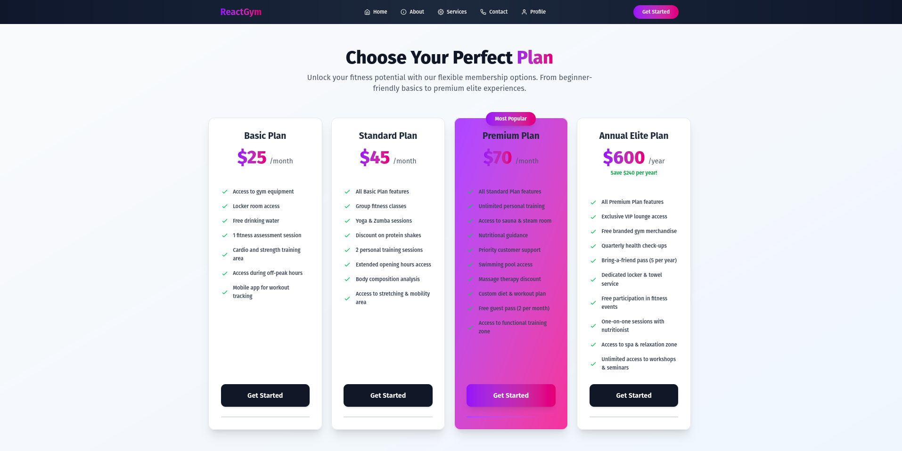
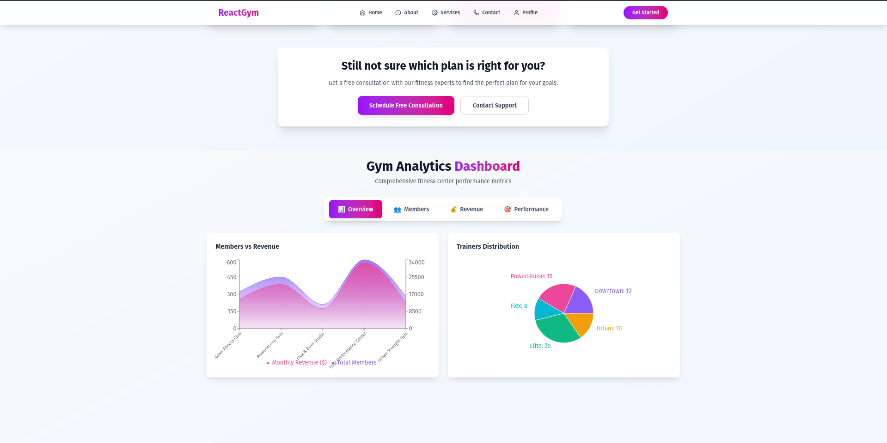

# React Gym 💪

A modern, responsive gym management application built with React.js featuring interactive pricing cards, analytics dashboard, and sleek navigation components.

## 🌐 Live Demo

**[View Live Application](https://beamish-meringue-8eef46.netlify.app/)**

## 📱 Screenshots

<div align="center">
  
  
</div>

## ✨ Features

### 🎯 Core Components
- **Modern Pricing Cards** - Interactive membership plans with gradient designs and hover effects
- **Analytics Dashboard** - Comprehensive gym statistics with multiple chart types using Recharts
- **Responsive Navbar** - Adaptive navigation with scroll effects and mobile-friendly design
- **Interactive Charts** - Line charts, bar charts, pie charts, and area charts for data visualization

### 🎨 Design Highlights
- **Gradient Themes** - Purple-to-pink gradients throughout the application
- **Smooth Animations** - Hover effects, transitions, and micro-interactions
- **Mobile-First** - Fully responsive design that works on all devices
- **Modern UI** - Clean, professional interface with glassmorphism effects

## 🛠️ Tech Stack

- **Frontend:** React.js
- **Charts:** Recharts
- **Styling:** Tailwind CSS
- **Icons:** React Icons (Heroicons, Feather Icons)
- **Deployment:** Netlify

## 📊 Dashboard Analytics

The analytics dashboard provides insights into:
- **Member Statistics** - Total and active membership data
- **Revenue Analysis** - Monthly revenue tracking across gym locations
- **Performance Metrics** - Group classes, trainer distribution, and member demographics
- **Interactive Visualizations** - Multiple chart types with custom tooltips and animations

## 🏋️ Pricing Plans

Four membership tiers available:
- **Basic Plan** - $25/month - Essential gym access
- **Standard Plan** - $45/month - Enhanced features with classes
- **Premium Plan** - $70/month - Full access with personal training
- **Annual Elite Plan** - $600/year - VIP experience with all amenities

## 🚀 Quick Start

1. **Clone the repository**
   ```bash
   git clone https://github.com/yourusername/react-gym.git
   cd react-gym
   ```

2. **Install dependencies**
   ```bash
   npm install
   ```

3. **Start development server**
   ```bash
   npm start
   ```

4. **Build for production**
   ```bash
   npm run build
   ```

## 📁 Project Structure

```
src/
├── components/
│   ├── Navbar/          # Navigation component
│   ├── PriceOption/     # Individual pricing card
│   ├── PriceOptions/    # Pricing section container
│   ├── LineChart/       # Analytics dashboard
│   ├── Feature/         # Feature list component
│   └── Link/            # Navigation link component
├── App.js               # Main application component
└── index.js             # Application entry point
```

## 🎨 Key Design Features

- **Custom Gradients** - Purple-to-pink color schemes
- **Card Layouts** - Modern card-based design with shadows and rounded corners
- **Interactive Elements** - Hover effects and smooth transitions
- **Typography** - Clean, hierarchical text styling
- **Responsive Grid** - Adaptive layouts for different screen sizes

## 📈 Analytics Features

- **Multi-tab Navigation** - Overview, Members, Revenue, and Performance sections
- **Real-time Data Visualization** - Dynamic charts with gym statistics
- **Custom Tooltips** - Enhanced user experience with detailed data points
- **Responsive Charts** - Charts adapt to different screen sizes

## 🔧 Dependencies

```json
{
  "react": "^18.x",
  "recharts": "^2.x",
  "react-icons": "^4.x",
  "prop-types": "^15.x"
}
```

## 🌟 Contributing

1. Fork the project
2. Create your feature branch (`git checkout -b feature/AmazingFeature`)
3. Commit your changes (`git commit -m 'Add some AmazingFeature'`)
4. Push to the branch (`git push origin feature/AmazingFeature`)
5. Open a Pull Request

## 📄 License

This project is open source and available under the [MIT License](LICENSE).

## 👨‍💻 Author

Built with ❤️ by **[Your Name]**

---

<div align="center">
  <p>⭐ Star this repo if you found it helpful!</p>
  
  **[Live Demo](https://beamish-meringue-8eef46.netlify.app/)** • **[Report Bug](../../issues)** • **[Request Feature](../../issues)**
</div>